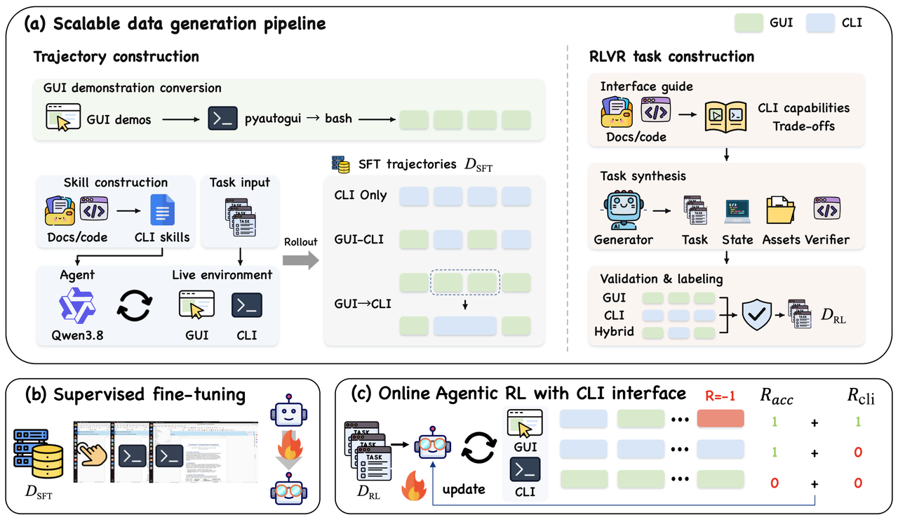

<div align="center">

# HybridCUA

**Learning to Orchestrate GUI and CLI for Computer-Use Agents**

📄 [Paper](https://arxiv.org/pdf/2609.38008) |
🌐 [Project Page](https://zjureal.com/HybridCUA/) |
🤗 [Dataset](https://huggingface.co/collections/077lukamagic/hybridcua) |
🤖 Models (coming soon)

[](https://arxiv.org/pdf/2609.38008)
[](https://huggingface.co/collections/077lukamagic/hybridcua)

[](LICENSE)
[](https://www.python.org/downloads/)

</div>

Computer-use agents act through clicks and keystrokes — general, but slow and
prone to cascading errors. Application APIs are faster but must be built per
application. HybridCUA instead pairs the GUI with the **command line**, which
ships with the OS and can collapse a long GUI sequence into one command.

The hard part is not shell *access* but knowing **when and how** to use it:
exposing a CLI to an untrained agent *costs* 2.5–11.5 points on OSWorld.
HybridCUA closes that gap with hybrid training data and CLI-aware rewards.

**HybridCUA-9B reaches 53.6% on OSWorld in 14.0 average steps** — +14.8 points
over its base model — and transfers to OSWorld-MCP (47.1%) and Windows (36.0%).

## Repository layout

```
HybridCUA/
├── env_infra/    desktop/mobile environment platform (OSWorld, MobileWorld, CUA-Gym)
├── online-rl/    GRPO training (slime + Megatron-LM actor, SGLang rollout)
└── site/         project page (static, no build step)
```

The two halves talk over HTTP: `env_infra` serves environments through a unified
`/v1/sessions` protocol, and `online-rl` only speaks to that endpoint — the
trainer never launches VMs or containers itself.

| Directory | Read next |
|---|---|
| `env_infra/` | [`env_infra/CLAUDE.md`](env_infra/CLAUDE.md) — architecture, session protocol, world adapters |
| `online-rl/` | [`online-rl/CLAUDE.md`](online-rl/CLAUDE.md) — rollout pipeline, the two layers of asynchrony, every `GUI_*` variable |
| `site/` | [`site/README.md`](site/README.md) — preview and deploy the project page |

## Quick start

```bash
# build the training venv — needs a GPU node with nvcc
git clone https://github.com/ZJU-REAL/HybridCUA.git && cd HybridCUA
bash online-rl/install_env.sh

# start an env server from env_infra, then launch on the head node
WANDB_API_KEY=<key> HF_CKPT=/path/to/sft/ckpt \
GUI_ENV_SERVER_URL=http://127.0.0.1:19000 \
  bash online-rl/gui-rl/scripts/HybridCUA-9B_16gpu_fully_async.sh

# each additional worker node joins the same Ray cluster
RAY_HEAD_ADDR=<head-ip> WORKER_NUM_GPUS=8 \
  bash online-rl/gui-rl/scripts/gpu_worker_join_ray.sh
```

Keep the three concurrency knobs aligned — the ceiling is their minimum:
`SGLANG_SERVER_CONCURRENCY × num_engines` (in-flight pool),
`GUI_FAST_ROLLOUT_PROCS` (worker pool), and `GUI_TRAJECTORY_CONCURRENCY`
(env sessions), all defaulting to 64. `online-rl/gui-rl/config.py` is the single
source of truth for every `GUI_*` variable.

## Method in brief

<p align="center">
  
</p>
<p align="center"><em>(a) Generation of GUI-only, CLI-only and interleaved trajectories, plus annotated RL tasks. (b) Supervised fine-tuning. (c) Online agentic RL with CLI-aware reward signals.</em></p>

**One action space.** Every executable interaction goes through the same
`bash` action — a direct shell command, or a quoted Python heredoc of
`pyautogui` calls. Switching interfaces costs the model no extra grammar.
Keeping the two in separate tools instead costs 7.2 accuracy points.

**HybridCUA-8K.** 5,023 supervised trajectories across 11 application domains
in three modes (GUI only 870, CLI only 3,155, interleaved 998), plus 3,000
verified RLVR tasks, each labelled by whether CLI use has a clear execution
advantage.

**Two-stage training.** SFT on the mixed corpus, then GRPO with two CLI-aware
rewards:

- `R_CLI` (trajectory level, λ=0.1) — rewards a successful rollout only when its
  CLI usage matches the task's label. Teaches **when**.
- `r_exec` (step level, λ=0.3) — penalises the tokens of a command that fails at
  the shell level. Teaches **how**.

Ablating them separates the two effects: without `R_CLI` the efficiency gain
stalls (18.2% shorter trajectories instead of 29.3%); without `r_exec`
execution errors climb to 16.5% instead of settling at 11.5%.

## Results

| Model | Action space | OSWorld Acc. ↑ | Avg. steps ↓ |
|---|---|---|---|
| Qwen3.5-9B | GUI | 38.8 | 31.6 |
| Qwen3.5-9B | GUI+CLI | 18.4 | 22.1 |
| ToolCUA-8B | GUI+API | 46.8 | 14.9 |
| AutoGLM-OS-9B | GUI+API | 48.9 | — |
| UltraCUA-32B | GUI+API | 43.7 | — |
| **HybridCUA-9B** | **GUI+CLI** | **53.6** | **14.0** |

Out-of-distribution: **47.1%** on OSWorld-MCP (+9.1 over the base model) and
**36.0%** on WindowsAgentArena (+4.0) — issuing PowerShell commands despite
training only on Linux shells.

Full tables, per-domain results and step-by-step case studies are on the
[project page](https://zjureal.com/HybridCUA/).

## Release

Trajectories, RLVR tasks, and the data-generation and training pipelines. See the
[Hugging Face collection](https://huggingface.co/collections/077lukamagic/hybridcua).
The HybridCUA-9B model is coming soon.

## Acknowledgements

Our work is motivated by [CUA-Gym](https://arxiv.org/abs/2605.25624), [ToolCUA](https://arxiv.org/abs/2605.12481),
and [UI-MOPD](https://arxiv.org/abs/2607.04425), and built on [slime](https://github.com/THUDM/slime).
Thanks for their wonderful work.

## Citation

```bibtex
@misc{chen2026hybridcualearningorchestrategui,
      title={HybridCUA: Learning to Orchestrate GUI and CLI for Computer-Use Agents}, 
      author={Tongbo Chen and Junbo Niu and Zhengxi Lu and Niu Lian and Fei Tang and Yuchen Yan and Yike Hong and Yong Du and Yizhou Liu and Bofan Chen and Yongliang Shen},
      year={2026},
      eprint={2609.38008},
      archivePrefix={arXiv},
      primaryClass={cs.CV},
      url={https://arxiv.org/abs/2609.38008}, 
}
```